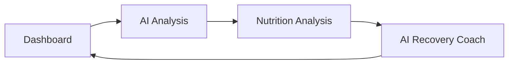

# 🏋️ FitFrik AI Recovery Coach
### AI-Powered Recovery & Performance Analysis Prototype

<p align="center">


</p>

---

# 📖 Overview

FitFrik AI Recovery Coach is a high-fidelity frontend prototype built to demonstrate an AI-assisted athlete recovery experience.

The prototype simulates how users can analyze workout performance, review nutritional insights, and receive personalized recovery recommendations through an intuitive multi-page dashboard.

This project focuses on user experience, navigation flow, and product visualization for stakeholder demonstrations.

> **Note:** This is a frontend prototype. Backend APIs, authentication, databases, and AI models are intentionally excluded.

---

# 🌐 Live Demo

### 🚀 Prototype

**YOUR_VERCEL_URL**

---

### 📂 GitHub Repository

https://github.com/YOUR_USERNAME/fitfrik-ai-recovery-coach

---

# ✨ Features

- 🏠 Interactive Dashboard
- 🤖 AI Analysis Workflow
- 🥗 Nutrition Analysis
- 💪 AI Recovery Coach
- 🔄 Multi-page Navigation
- 📱 Responsive User Interface
- ⚡ Fast React + Vite Performance
- 🎨 Modern Tailwind UI
- 📊 Recovery Score Visualization
- 🧭 Clickable Prototype for Product Demonstration

---

# 📸 Screenshots

## 🏠 Dashboard


---

## 🤖 AI Analysis


---

## 🥗 Nutrition Analysis


---

## 💪 Recovery Coach


---

# 🏗️ Prototype Workflow



---

# 🧠 User Journey

```text
Dashboard

      │

      ▼

Scan Meal

      │

      ▼

AI Analysis

      │

      ▼

Nutrition Analysis

      │

      ▼

Recovery Coach

      │

      ▼

Dashboard
```

---

# ⚙️ Tech Stack

| Technology | Purpose |
|------------|---------|
| React 19 | Frontend Framework |
| TypeScript | Type Safety |
| Vite | Development & Build Tool |
| React Router | Page Navigation |
| Tailwind CSS | UI Styling |
| Google Stitch | Initial UI Generation |
| Cursor AI | Code Generation & Refactoring |

---

# 📂 Project Structure

```text
fitfrik-ai-recovery-coach
│
├── assets
│   ├── dashboard.png
│   ├── analysis.png
│   ├── nutrition.png
│   └── recovery.png
│
├── src
│   ├── pages
│   │   ├── DashboardPage.tsx
│   │   ├── AnalysisPage.tsx
│   │   ├── NutritionPage.tsx
│   │   └── RecoveryPage.tsx
│   │
│   ├── App.tsx
│   ├── main.tsx
│   └── index.css
│
├── package.json
├── vite.config.ts
└── README.md
```

---

# 🚀 Getting Started

## Clone Repository

```bash
git clone https://github.com/YOUR_USERNAME/fitfrik-ai-recovery-coach.git
```

---

## Install Dependencies

```bash
npm install
```

---

## Run Development Server

```bash
npm run dev
```

---

## Production Build

```bash
npm run build
```

---

# 🎯 Current Prototype Scope

✅ Dashboard

✅ AI Analysis

✅ Nutrition Analysis

✅ Recovery Coach

✅ React Navigation

✅ Responsive Layout

---

# 🔮 Future Roadmap

- 🤖 Real AI Recovery Recommendations
- 📷 Computer Vision Pose Analysis
- 🍎 AI Food Recognition
- 📈 Workout Performance Analytics
- ⌚ Wearable Device Integration
- ☁️ Cloud Backend
- 🔐 User Authentication
- 📊 Progress Tracking
- 📅 Recovery Scheduling
- 🧠 Personalized AI Coaching

---

# 🎯 Purpose

This prototype was created to demonstrate the product vision, navigation flow, and user experience of the FitFrik AI Recovery Coach before backend and AI implementation.

It serves as a proof of concept for internal product discussions, stakeholder presentations, and future development planning.

---

# 👨‍💻 Developer

**Vikas Mandlik**

Computer Engineering Student

AI / ML • React • Product Engineering

GitHub: https://github.com/YOUR_USERNAME

LinkedIn: https://linkedin.com/in/YOUR_LINKEDIN

---

# 📄 License

This project is intended for demonstration and prototype purposes.

© 2026 Vikas Mandlik. All rights reserved.